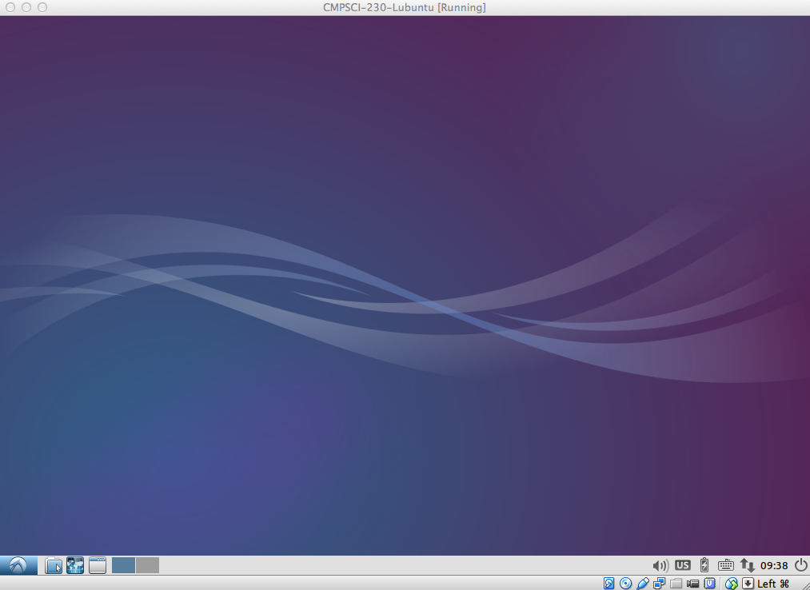
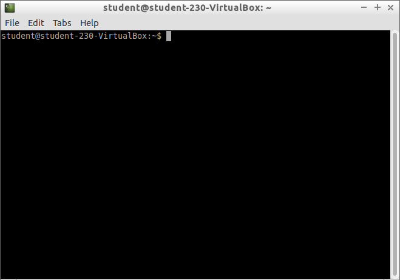

# COMPSCI 230 Computer Systems Principles 

## Project Assignment: The Shell

## Overview

This assignment will help you get adjusted to the programming
environment you will be working in for the rest of the semester in
this course.  In particular, completing the exercises below will help
you better understand how to use VirtualBox, Lubuntu, the command line,
and some basic Unix commands.  In addition, you will complete a few
programming exercises that will orient you to programming and
compiling from the command line and working with a text editor rather
than an Integrated Development Environment (IDE) such as
Eclipse.  Lastly, you will explore the notion of software layers
through a programming exercise using the Java programming language (as
we have not yet covered C).

## Suggested Reading

You should do the reading for week 1 of this course, in particular,
the [Command Line Crash Course](https://goo.gl/TEs2ms). This will
give you a solid overview of the Unix command line programs and
utilities that you will need to complete this assignment.

## Rubric

Your submission will be evaluated by running the same tests as those
that have been provided to you. However, we will copy the following
files into a fresh copy of the starter code:

* `solution.sh`
* `Duck.java`
* `duck.c`

and execute the following commands:

* `source solution.sh`
* `source test/test-all`

Running `test/test-all` will produce the following result if all tests
are correct:

```bash
test01 points: 6
test02 points: 2
test03 points: 2
test04 points: 2
test05 points: 2
test06 points: 2
test07 points: 2
test08 points: 4
test09 points: 12
test10 points: 10
```

The total score will then be recorded in Moodle. If all test cases
pass the total score is 44 and that is what is recorded in Moodle. If
any tests fail, those points will be deducted from your total score
and that will be recorded in Moodle.

## Part 1: Download and Install VirtualBox

The first step in this course is to set up your programming
environment. All programming will be completed in a 32-bit x86/Linux
environment. It is important that you have the precise environment so
you can follow along in later lectures and complete the homework
assignments correctly.  We will be running Lubuntu Linux (A
light-weight variant of Ubuntu) in a virtual machine (VirtualBox).
So, the first step is to install VirtualBox.

Please visit the [VirtualBox downloads page](https://goo.gl/l3wrf) to
install the version of VirtualBox for your platform.  The installation
process is straightforward and you shouldn't have much trouble. If you
do run into any problems be sure to post questions to the Piazza
discussion forum immediately and/or ask questions during the lab section.

## Part 2: Download and Import Virtual Machine

The next step requires you to download the
the [Lubuntu virtual machine image][lubuntu] that we have prepared.
This is a single file that represents the Linux environment and all
the software you are required to accomplish programming tasks in this
course. (Note: it is 1.6 Gb in size, so download in a situation where
you have adequate bandwidth, and clearly you will need enough free
space in your file system!)  After you download this file you need to
import the virtual machine into your VirtualBox environment.  You can
read the [import instructions][importing] for more detail on how to
accomplish this.  Again, this should be relatively straightforward.
If you run into any problems you should post to Piazza.  Note that you
should try to troubleshoot the import yourself before you fire off
posts to Piazza.  If you are stuck - then make the post (first
checking previous posts, please)!

[lubuntu]: http://roc.cs.umass.edu/~richards/230/ova/CMPSCI-230-Lubuntu.ova
[importing]: http://docs.oracle.com/cd/E26217_01/E26796/html/qs-import-vm.html

## Part 3: Booting Up The Virtual Machine

After you import the virtual machine in Part 2 you are ready to boot
up the machine.  This is easy: select the imported virtual machine and
click on the **Start** button.  This will begin the boot process and
eventually be presented with the Lubuntu desktop.



You should be automatically logged in to the virtual machine.  Your
username in the virtual machine is **student** and the default
password is **student**.  If you do not interact with the virtual
machine for some time it will go to a lock screen where you may need
to type in the username and password.  You may also need to use the
username and password if you need to install any additional software
in the future.

To "halt" the virtual machine you should simply click on the left-most
button on the toolbar and click "Logout".  This will open a menu where
you can "Shutdown" the virtual machine.  (You can also pause it or save it
(similar to hibernation) from the VirtualBox Manager window.)

## Part 4: Opening Up Terminal

At this point you have a running Lubuntu virtual machine and you can
open up a terminal to run some basic commands.  You can open a terminal
by clicking on the left-most button on the bottom toolbar.  You will be
presented with a menu.  Click on the top-most menu item ("Accessories")
followed by the "LXTerminal" entry.  This will open up a terminal
window:



You can figure out where you are by running the following Unix
command:

```bash
$ pwd
/home/student
```

This is your current user directory, often referred to as your "home
directory", where you will complete all of your project assignments as
well as where you can "play" with the Unix command line to practice.

## Part 5: Terminal Fun!

In this part of the assignment you will get familiar with some Unix
commands.  You **must** follow the instructions exactly in order to get
full credit.  An important aspect of this course is to be *precise* and
*exact* with what you are required to do.  As you will see in later
assignments, more code does not necessarily provide the best
solutions.  In particular, the success of a project coding assignment
is often dependent on only a few lines of code.  So, **pay attention**!

### Part 5.0: Project Startup

[starter]: https://github.com/umass-cs-230/project-student-the-shell/archive/master.zip

Please [download the project startup zipfile][starter] associated with
this assignment. To do this, open a web browser by clicking on the
left-most menu button followed by "Internet".  We have installed
firefox and Chromium for you to use.  Some people have more success
with one, some with the other, and if both work, just go with whatever
suits you.  You should do this by downloading the file from within
your virtual machine so you can download the zipfile to your virtual
machine disk.  You should download the zipfile to your home directory.
By default, Chromium will download to the "Downloads" folder.  You can
change this by clicking on "student" in the save dialog box.
Alternatively, you can download to the "Downloads" folder and then run
the following Unix command from the terminal inside your home
directory:

```bash
$ mv Downloads/project-student-the-shell-master.zip .
```

Remember, the `.` represents your current working directory, in this
case your home directory.  This command will move the zipfile to your
home directory.  You can verify this using the `ls` command.  Once you
have the zipfile in your home directory you can execute the following
command:

```bash
$ unzip project-student-the-shell-master.zip
```

This will *unarchive* the contents of the zipfile and you will see the
`project-student-the-shell-master` directory.  You can then go into
that directory from the terminal using `cd` (change directory):

```bash
$ cd project-student-the-shell-master
```

Remember, if you can't remember what a command does you can always use
the `man` command to find out more.  For example, to know more about
the `ls` command you simply type the following:

```bash
$ man ls
```

This will display the documentation for `ls` using the `more`
command.  To get out of the documentation simply type `q` (for "quit").
If you forget how to do something go back to the reading.

Please complete the following exercises from within the
`project-student-the-shell-master` directory.

### Part 5.1: Making Directories

From the command line use the `mkdir` command to create the following
directories:

```bash
foo
bar/baz
fee/fie/foo/fum
```

To see if you did this correctly run the following command:

```bash
$ source test/test01
```

This will run a test to check if you created the directories
correctly.  If you did this correctly you get 6 points! If you did not
get the 6 points figure out what you did wrong and correct it for full
credit.

### Part 5.2: Creating Files

There are a number of ways to create files in Unix.  The first way to
do it is to simply "touch" a file.  The `touch` command changes the
access and modification time of a file.  If the file does not exist it
will create a new empty file.  Try it:

```bash
$ touch foo/touching.txt
```

You can verify that it exists by using the ls command:

```bash
$ ls foo/*
```

The `*` will list everything in the directory.  The `*` is a special
character that "matches" anything.  If you want only show files in the
`foo` directory that have a `.txt` file extension then you can do this:

```bash
$ ls foo/*.txt
```

You can also run `test02` to verify that you have performed this step
successfully:

```bash
$ source test/test02
```

Next, you will use an editor to record the commands you have typed in
so far.  You are welcome to use any editor.  We have installed emacs,
vim, and SublimeText in your virtual machine.  Use one of the following
commands to open an editor to edit a file called `solution.sh` in your
`project-student-the-shell-master` directory:

```bash
$ subl solution.sh
```

```bash
$ emacs solution.sh
```

```bash
$ vim solution.sh
```

Each of the above will open an editor of your choice.  We recommend
using SublimeText to start (the `subl` command) as it is the most
straightforward.  Once you have the file open you must type in the
commands that you entered in part 5.1 and 5.2 up to this point.  You
should type in only the commands for creating the directories in 5.1
and for "touching" the "touching.txt" file.  For more information about
each of the above editors please see [sublimetext], [emacs], or [vim]
(or simply google them).  Make sure to *save* your `solution.sh` file
after you have typed in the commands!

After you complete this exercise you should have a `solution.sh` file
in your `project-student-the-shell-master` directory.  Run `test03` to
verify:

```bash
$ source test/test03
```

### Part 5.3: Running Your Commands

Now, you need to verify that the commands in your `solution.sh` are
correct.  To do this you need to first delete each of the directories
in part 5.1 using the `rm` command.  You should use the following
command to make this work:

```bash
$ rm -rf foo
$ rm -rf bar
$ rm -rf fee
```

(This can also be done as one command: `rm -rf foo bar fee`.)

You should use `man` to figure out what the `-r` and `-f` options to
the `rm` command do.  Next, you need to "run" the commands you typed
into your `solution.sh` file to see if they are correct:

```bash
$ source solution.sh
```

If you typed everything in correctly you will see that you once again
have the directories and file you typed in for parts 5.1 and
5.2.  Lastly, add the `rm` commands above to the top of you
`solution.sh` file (i.e., *before* the other commands) and use `source` again
to execute the commands in your file.  You can verify that you have
done this correctly by running `test01`, `test02`, and `test03` again: 

```bash
$ source test/test01
$ source test/test02
$ source test/test03
```

You should see this:

```bash
test01 points: 6
test02 points: 2
test03 points: 2
```

Congrats! You just created your first shell script!

### Part 5.4: Command Line Exercises

For each of the following you should add a command to the end of your
`solution.sh` file created in part 5.3.  You should "source" your
`solution.sh` file to execute it to make sure you are recording the
command properly.  It is always easier to first try it from the command
line to make sure it works.

1) Use the `cp` command to copy the `foo/touching.txt` file to
`fee/fie/touching-copy.txt`.  After you get the right command, add it
to the end of your `solution.sh` file, run the `solution.sh` file, and
verify that you have done things correctly with `source test/test04`.

2) Use the `cat` command to concatenate the files `kt1.txt` and
`kt2.txt` into a new file in `bar/baz/kt-quotes.txt`.  After you get
the right command, add it to the end of your `solution.sh` file, run
the `solution.sh` file, and verify that you have done things correctly
with `source test/test05`.  It is helpful to review the material
related to [Exercise 13][ex13] and [Exercise 15][ex15] in the command
line book.

3) Use the `cat` command to concatenate the file `random.txt` to
standard output.  The `random.txt` file contains a list of random
numbers where each number is on a separate line.  Then, *pipe* the
output from the `cat` command into the `sort` command.  The `sort`
command will sort data.  You want to sort the random numbers in numeric
order.  You should consult the man page for the `sort` command to see
which option you must supply to `sort` to make this work
correctly.  Lastly, when you are convinced that you are sorting
properly you must redirect the output of the sort command to the file
`fee/fie/foo/fum/sorted.txt`.  After you get the right command, add it
to the end of your `solution.sh` file, run the `solution.sh` file, and
verify that you have done things correctly with `source
test/test06`.  This should all be done on a single line, that is, you
should not create any intermediate files to get the final `sorted.txt`
file.

4) Use the `grep` command to search for the numbers containing `101` in the
`fee/fie/foo/fum/sorted.txt` file.  Pipe the output to the `sort`
command to sort numerically.  Then redirect the output from `sort` to
the file `fee/fie/foo/fum/found.txt` file.  After you get the right
command, add it to the end of your `solution.sh` file, run the
`solution.sh` file, and verify that you have done things correctly
with `source test/test07`.

5) Use the `wc` command to count the *number of lines* in the
`fee/fie/foo/fum/sorted.txt` file.  Use the `wc` command to count the
*number of bytes* in the `fee/fie/foo/fum/found.txt` file.  Note you 
want to use two separate commands for this task.  Append the
output from each of these commands to the end of the
`bar/baz/kt-quotes.txt` file.  After you get the right commands, add each
command to the end of your `solution.sh` file, run the `solution.sh` file, and
verify that you have done things correctly with `source
test/test08`.

## Part 6: A Simple Java Program

This part of the assignment will have you write a simple Java program
using a text editor, compile the Java program, and output the
disassembled bytecode to a file.  First, create a new file called
`Duck.java` in the `project-student-the-shell-master` directory.  Type
in the following code (yes, type it in, do not cut and paste - that is
lame!):

```Java
public class Duck {
  private final String name;
  public Duck(String name) {
    this.name = name;
  }
  
  public String talk() {
    return "Duck " + name + " says Quack!";
  }
  
  public static void main(String[] args) {
    Duck duck = new Duck("Joe");
	System.out.println(duck.talk());
  }
}
```

Make sure to save the contents of this file.  Now, test to make sure
that you file has been written correctly by compiling it from the
command line using the Java compiler program `javac`:

```bash
$ javac Duck.java
```

Next, see if it runs correctly by running the Java Virtual Machine
(`java`) from the command line:

```bash
$ java Duck
Duck Joe says Quack!
```

Now, see what the disassembled bytecode looks like:

```bash
$ javap -c Duck
```

Lastly, add the following commands to the end of your `solution.sh`
file and run it to make sure it compiles, executes, and disassembles
your Duck class:

```
rm -f Duck.class
rm -f ducky.bc
javac Duck.java
java Duck > fee/quack.txt
javap -c Duck > ducky.bc
```

to make sure you have done everything correctly run `test/test09`.

## Part 7: A Simple C Program

The last part of this assignment is to write a simple C program,
compile it, and run it.  Type the following code into a file called
`duck.c` in your `project-student-the-shell-master` directory:

```c
#include <stdio.h>

int main() {
  printf("Duck Joe says Quack!\n");
}
```

Now compile the C program like this:

```bash
$ gcc duck.c -o duck
```

And execute the resulting *executable object file* (binary) like this:

```bash
$ ./duck
Duck Joe says Quack!
```

Now add the following to the end of your `solution.sh` file:

```
rm -f duck
rm -f fee/cuack.txt
gcc duck.c -o duck
./duck > fee/cuack.txt
```

to make sure you have done everything correctly run `test/test10`.

Now that you have completed the entire assignment you should run the
final test to make sure that everything is working properly:

```bash
$ source test/test-all
```

If you do not see any errors then you are in good shape.

## Submission Instructions

You must submit your assignment as a zipfile. After you complete the
assignment you need to run the following command from the parent
directory of the your `project-student-the-shell-master`
directory. **Make sure you deleted the original zipfile you downloaded
containing the starter code** So, assuming you are already in your
`project-student-the-shell-master` directory you want to execute the
following commands from the command line:

```bash
$ cd ..
$ zip -r project-student-the-shell-master project-student-the-shell-master
```

This will create the file `project-student-the-shell-master.zip` which
you need to upload to Moodle.  Please submit your assignment to Moodle
by the assigned due date. Please make sure you have followed all the
instructions described in this assignment. Failure to follow these
instructions precisely will likely lead to considerable point
deductions and possibly failure for the assignment.

[sublimetext]: http://www.sublimetext.com
[emacs]: http://www.jesshamrick.com/2012/09/10/absolute-beginners-guide-to-emacs
[vim]: http://blog.interlinked.org/tutorials/vim_tutorial.html
